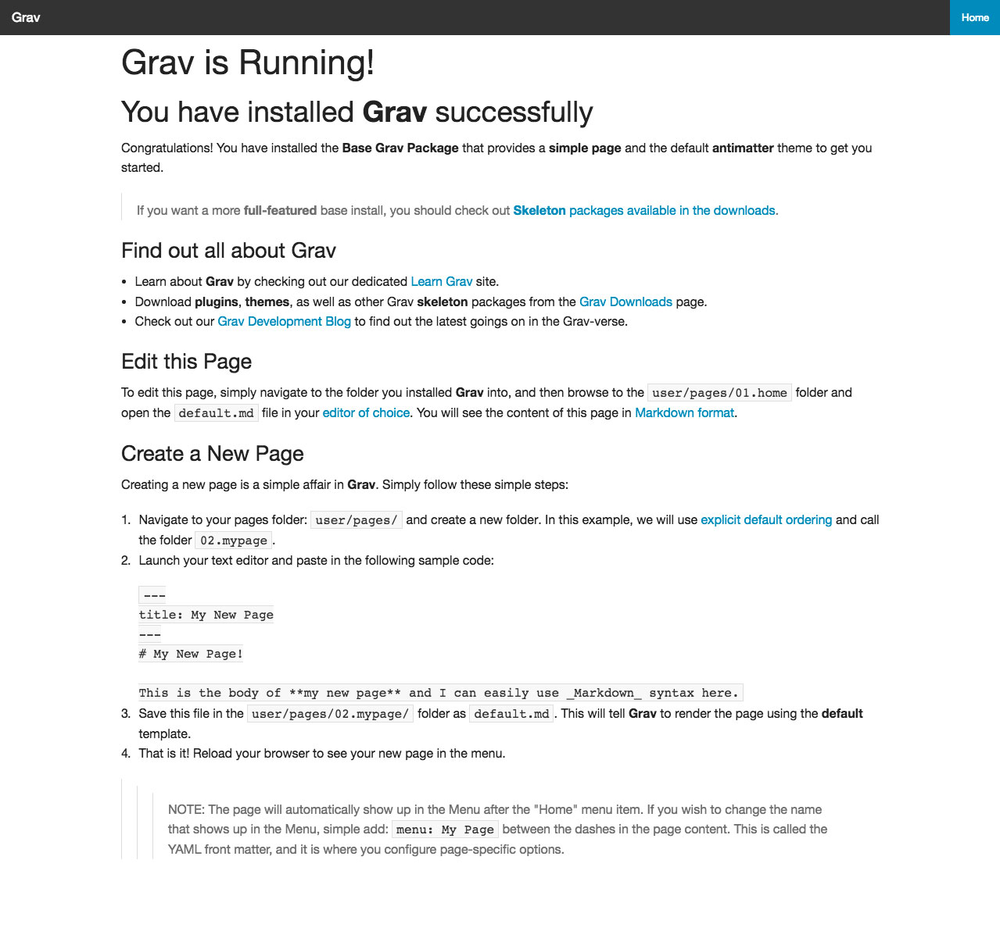

# Tango

# Development Process

The Tango theme includes a Gulp script to compile the SCSS into CSS. You'll need to install [NPM](https://www.npmjs.com/package/npm), [Bower](http://bower.io/) and [Gulp](http://gulpjs.com/) for this. If you have [NPM](https://www.npmjs.com/package/npm) installed this is pretty simple. From the Tango theme directory (`/user/themes/tango`), type the following:

    npm install --global gulp
    npm install --save-dev gulp
    npm install
    bower install

This will install all the required packages.

When in development you can run:

    gulp watch

to watch your SCSS files for changes and compile the CSS.
